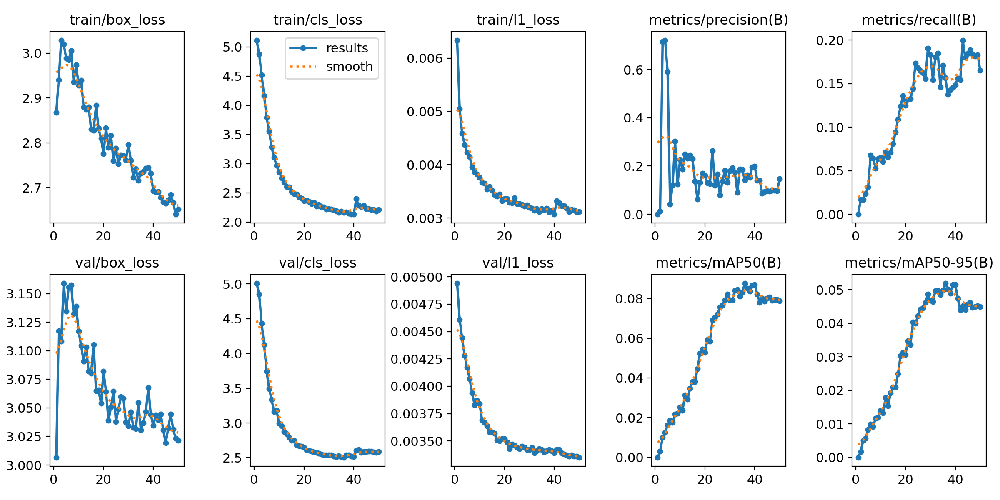
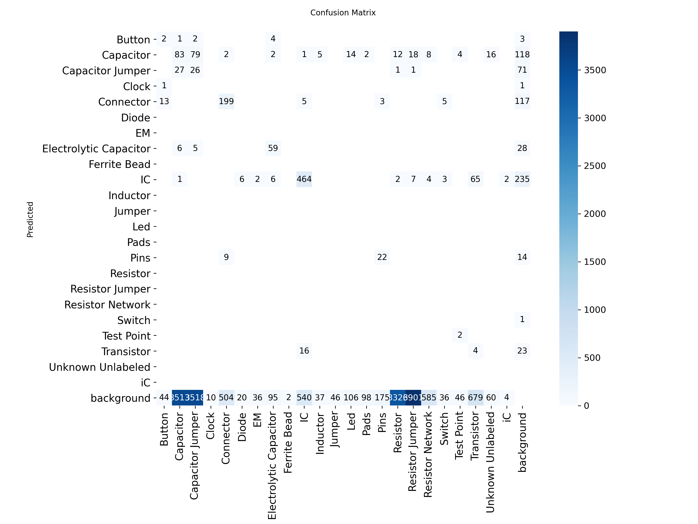

# pcb-component-detection-yolo26
Fine-tuned yolo26 nano object-detection model on images of printed-circuit-boards and their labeled components.

## Problem
PCB electrical components can come in very small sizes which makes PCB inspection and quality assurance a more challenging and tedious task. 

## Approach
From pretrained-COCO weights, fine-tuned **YOLO26-nano** on a **672-image** custom dataset (Roboflow) trained on Colab **T4 GPU** for <N> epochs at 640px.

## Results
Evaluated on the held-out validation split:

| Metric | Score |
|--------|-------|
| mAP50  | 0.088      |
| mAP50-95 |   0.052   |
| Precision |      |
| Recall |       |

**Training curves** - 

**Confusion matrix** - 

## Next steps

## How to reproduce
This project runs in **Google Colab** (free T4 GPU).

1. Open the notebook in Colab:
   
2. Set the runtime to GPU: **Runtime → Change runtime type → T4 GPU**.
3. Dataset: PCB component detection dataset (Roboflow, YOLO format). Add your
   Roboflow API key in the dataset cell, or point the notebook at your own copy.
4. Run all cells top to bottom. Training outputs (weights, results.png,
   confusion_matrix.png) are written to the session's `runs/` folder — mount
   Drive first if you want them to persist.
5. Baseline run: `epochs=50, imgsz=640`. Improved run: `epochs=150, imgsz=1280`.
